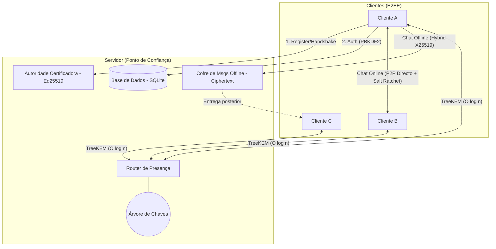
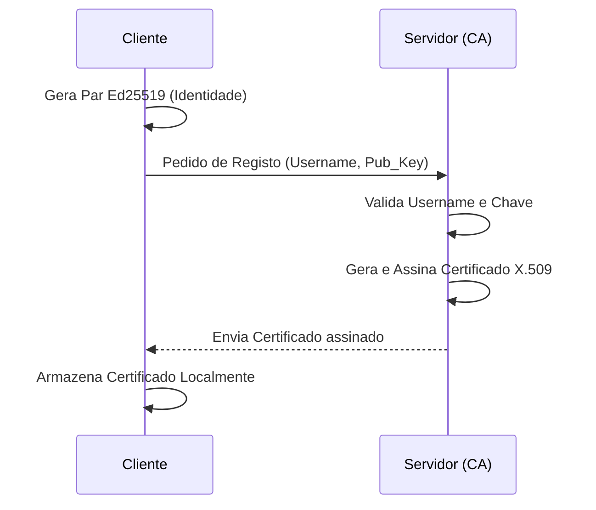
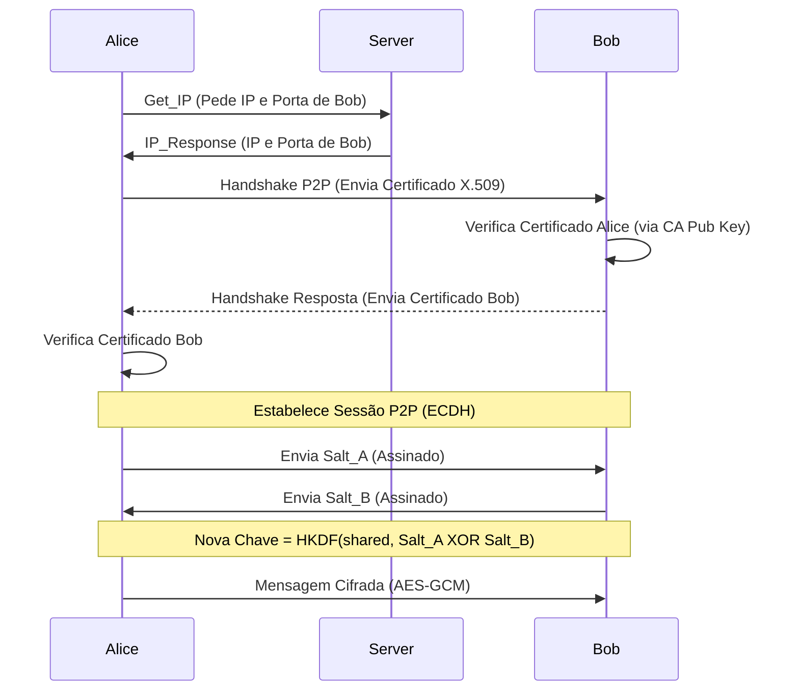
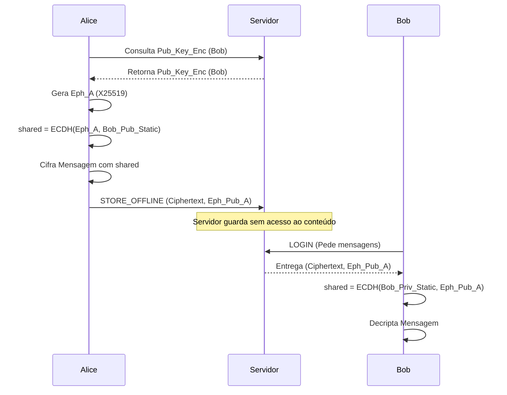
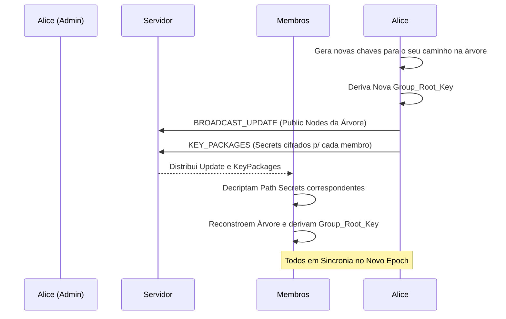

# Relatório Técnico
## Sistema de Mensagens P2P com Cifra de Ponta-a-Ponta

**Unidade Curricular:** Segurança em Sistemas Informáticos
**Ano lectivo:** 2025/2026
---
**Alunos:** 

Alexandre Ferrete a107336

Dinis Costa a106872

Lucas Martins a107333

---

## 1. Arquitetura, Fluxos e Funcionalidades

O SSIchat é um sistema de mensagens seguro com arquitetura híbrida cliente-servidor/P2P. O servidor actua como directório de utilizadores, autoridade certificadora (CA) e repositório de mensagens offline; toda a comunicação de conteúdo é cifrada de ponta-a-ponta (E2EE).

### 1.1 Diagrama de Arquitetura Geral

O sistema é composto por múltiplos clientes que comunicam entre si diretamente (P2P) para mensagens em tempo real, utilizando o servidor como intermediário para descoberta, autenticação e armazenamento assíncrono.

### 1.2 Metodologia de Gestão de Chaves

A gestão de chaves é descentralizada no que toca ao conteúdo e centralizada no que toca à identidade:

1.  **Chaves de Identidade (Ed25519):** Geradas pelo cliente no primeiro registo. A chave privada nunca sai do dispositivo (armazenada cifrada com a password do utilizador via PBKDF2). A chave pública é enviada ao servidor para emissão de um certificado X.509.
2.  **Chaves de Encriptação (X25519):** Utilizadas para estabelecer segredos partilhados (ECDH). Cada cliente possui um par estático para mensagens offline e gera pares efêmeros para handshakes de sessão (C-S e P2P).
3.  **Chaves de Sessão (AES-256):** Derivadas via HKDF a partir de segredos ECDH. Estas chaves são rotacionadas constantemente através de mecanismos de *ratchet*.
4.  **Chaves de Grupo (TreeKEM):** Uma hierarquia de chaves (árvore binária) onde a raiz representa a chave actual do grupo. Cada membro conhece apenas as chaves no seu caminho direto até à raiz.

### 1.3 Fluxos de Comunicação por Funcionalidade

#### 1.3.1 Registo e PKI (Emissão de Certificados)
O processo de registo estabelece a identidade digital do utilizador. O cliente gera localmente um par de chaves **Ed25519**, garantindo que a chave privada nunca abandona o dispositivo. Ao enviar a chave pública para o servidor, este atua como uma **Autoridade de Certificação (CA)**, validando o username e emitindo um certificado **X.509** assinado. Este certificado servirá como a "âncora de confiança" que outros utilizadores usarão para verificar a autenticidade do peer durante comunicações P2P.

#### 1.3.2 Login e Estabelecimento de Canal Seguro (Handshake)
O SSIchat utiliza um fluxo de handshake invertido para máxima segurança. Assim que a ligação TCP é estabelecida pelo cliente, o servidor toma a iniciativa de enviar um `SERVER_HELLO` com uma chave efémera **X25519** assinada pela CA. Isto permite ao cliente validar a identidade do servidor via *Certificate Pinning* antes de enviar qualquer dado. Após a troca de chaves efémeras, ambos derivam um segredo partilhado via **ECDH** e utilizam **HKDF** para criar as chaves de sessão. Só após este canal seguro estar ativo é que o cliente envia as suas credenciais (`AUTH`) para autenticação.

```mermaid
sequenceDiagram
    participant Cliente
    participant Servidor

    Servidor->>Cliente: SERVER_HELLO (Eph_Pub_S + Assinatura_CA)
    Cliente->>Cliente: Verifica Assinatura (Root CA Pinning)
    Cliente->>Servidor: CLIENT_HELLO (Eph_Pub_C)

    rect rgb(61, 61, 61)
    Note over Cliente, Servidor: Derivação de Segredo (X25519 ECDH)
    Cliente->>Cliente: shared = ECDH(Priv_C, Eph_Pub_S)
    Servidor->>Servidor: shared = ECDH(Priv_S, Eph_Pub_C)
    end

    Note over Cliente, Servidor: Canal Seguro Estabelecido (AES-256-GCM)

    Cliente->>Servidor: AUTH (Username, PBKDF2_Hash)
    Servidor->>Servidor: Verifica Credenciais
    Servidor-->>Cliente: LOGIN_SUCCESS
```

#### 1.3.3 Chat P2P Online (Com Salt Ratchet)
Em comunicações em tempo real, os clientes operam em modo descentralizado. Após obterem o endereço IP um do outro através do servidor, estabelecem uma ligação direta onde trocam os seus certificados X.509 para autenticação mútua. Para garantir **Forward Secrecy**, o sistema utiliza um mecanismo de **Salt Ratchet**: periodicamente, os peers trocam *salts* aleatórios assinados. A nova chave de encriptação é derivada combinando (XOR) estes salts com a chave anterior, garantindo que nenhum peer consegue prever ou controlar unilateralmente as chaves futuras.

#### 1.3.4 Mensagens Offline (Assíncronas)
Para garantir a privacidade quando o destinatário está desligado, o sistema utiliza encriptação híbrida. O remetente cifra a mensagem utilizando um segredo derivado de uma chave efémera própria e da chave pública estática do destinatário. O servidor recebe o *ciphertext* e a chave pública efémera, mas como não possui a chave privada do destinatário, é tecnicamente incapaz de ler o conteúdo. O destinatário, ao entrar online, recupera o pacote e utiliza a sua chave privada para reconstruir o segredo e ler a mensagem, mantendo a integridade da **E2EE** mesmo sem ligação direta.

#### 1.3.5 Mensagens de Grupo (TreeKEM)
A gestão de grupos multi-utilizador é feita através de uma variante do **TreeKEM**. Em vez de cifrar a chave do grupo individualmente para cada membro (custo linear), o sistema organiza os membros numa árvore binária de chaves. Quando um membro altera a sua chave ou o grupo sofre alterações, as atualizações são propagadas apenas ao longo do caminho direto até à raiz da árvore, resultando num custo logarítmico **O(log n)**. Este método não só é mais eficiente para grupos grandes, como também oferece **Post-Compromise Security (PCS)**, pois a renovação frequente da árvore invalida chaves que possam ter sido comprometidas no passado.

---

## 2. Modelo de Segurança

### 2.1 Justificação das Primitivas e Comparação com Alternativas

A escolha dos algoritmos no SSIchat baseou-se no estado da arte da criptografia aplicada, privilegiando a resistência a ataques de canal lateral, performance e simplicidade de implementação correta.

#### A. Assinatura Digital: Ed25519 vs RSA/ECDSA
*   **Escolha:** **Ed25519**
*   **Porquê:** Ao contrário do RSA, o Ed25519 utiliza chaves muito menores (256 bits vs 2048+ bits) para segurança superior, resultando em menos overhead de rede. 
*   **Comparação:** Face ao ECDSA (usado no TLS clássico), o Ed25519 é **determinístico**. O ECDSA requer um nonce aleatório por assinatura; se esse nonce for reutilizado ou previsível, a chave privada é exposta. O Ed25519 elimina esta classe de falhas por design. Além disso, a curva Edwards utilizada foi desenhada para ser imune a muitos ataques de timing (canal lateral).

#### B. Troca de Chaves: X25519 (ECDH) vs DH Clássico/NIST
*   **Escolha:** **X25519**
*   **Porquê:** Oferece o melhor compromisso entre segurança e velocidade.
*   **Comparação:** O Diffie-Hellman clássico (Modular) requer grupos enormes (3072+ bits) para ser seguro hoje, sendo computacionalmente pesado. Em relação às curvas do NIST (como a P-256), a curva **Curve25519** (X25519) possui parâmetros públicos e verificáveis, sem constantes "mágicas" suspeitas de backdoors, e é mais eficiente em termos de CPU.

#### C. Cifra Simétrica: AES-256-GCM vs AES-CBC/ChaCha20
*   **Escolha:** **AES-256-GCM**
*   **Porquê:** É um esquema **AEAD** (Authenticated Encryption with Associated Data), o que significa que garante confidencialidade e integridade simultaneamente.
*   **Comparação:** O modo CBC exige um MAC (como HMAC) separado para ser seguro (Encrypt-then-MAC); se for mal implementado, é vulnerável a ataques de *padding oracle*. O GCM resolve isto de forma nativa. Escolheu-se a variante de **256 bits** para oferecer uma margem de segurança extra contra avanços em computação quântica (Algoritmo de Grover), onde o AES-128 teria a sua segurança reduzida para apenas 64 bits.

#### D. Derivação de Chaves: HKDF-SHA256 vs Hash Simples
*   **Escolha:** **HKDF**
*   **Porquê:** Segue o paradigma "extract-and-expand".
*   **Comparação:** Utilizar um hash simples como `SHA256(secret)` para criar uma chave é arriscado porque o output do segredo ECDH pode não ter entropia uniforme. O HKDF garante que as chaves derivadas são estatisticamente independentes e permite a **separação de contexto** (usando a string `info`), garantindo que a mesma chave mestra não produz chaves idênticas para propósitos diferentes (ex: TX vs RX).

#### E. Password Hashing: PBKDF2-SHA256 vs Argon2id
*   **Escolha:** **PBKDF2 (600.000 iterações)**
*   **Porquê:** Elevada compatibilidade e standardização (NIST/OWASP).
*   **Comparação:** Embora o **Argon2id** seja superior por oferecer resistência a ataques via GPU/ASIC (através do uso intensivo de memória), o PBKDF2 foi escolhido por estar disponível nativamente na biblioteca base do projeto sem dependências C complexas. Para compensar a falta de *memory-hardness*, elevou-se o número de iterações para 600.000, tornando o custo de brute-force computacionalmente proibitivo para um atacante comum.

### 2.2 Garantias de Segurança

1.  **Confidencialidade Ponta-a-Ponta:** O servidor nunca tem acesso às chaves de cifra de conteúdo.
2.  **Integridade e Autenticidade:** O uso de GCM e certificados X.509 (Ed25519) garante que as mensagens não são alteradas e provêm de quem afirmam.
3.  **Forward Secrecy (FS):** O comprometimento de uma chave de longa duração (CA ou Identidade) não compromete sessões passadas devido ao uso de chaves efêmeras e ratcheting.
4.  **Post-Compromise Security (PCS) em Grupos:** Através do TreeKEM, o grupo recupera a segurança total após um membro realizar um *update* ou após mudanças na composição do grupo.
5. **Anonimato:** O servidor apenas sabe que dois clientes estão a comunicar, mas nunca tem acesso às mensagens, garantindo anonimato.

---

## 3. Melhorias Futuras

Após a execução deste trabalho, por motivos de falta de tempo e maiores níveis de complexidade, nós fizemos uma abordagem de melhorias futuras do trabalho:

 *  **Protocolo X3DH (Extended Triple Diffie-Hellman):** Evoluir o mecanismo de mensagens offline para utilizar **Pre-keys**. Atualmente, a dependência numa chave estática do destinatário não fornece *ForwardSecrecy* a longo prazo. O X3DH permitiria handshakes assíncronos que garantem FS mesmo quando o destinatário está offline.
*   **Autenticação Criptográfica de Remetente (Offline):** Incluir assinaturas digitais Ed25519 em cada pacote de mensagem offline. Isto mitigaria o risco de um servidor malicioso personificar remetentes ao entregar pacotes cifrados por atacantes, garantindo que a origem da mensagem é verificável independentemente do servidor.
*   **Privacidade de Metadados (PIR):** Implementar **Private Information Retrieval** para a consulta de chaves públicas. Atualmente, o servidor sabe quem quer falar com quem pelo pedido da chave. Com PIR, o cliente recupera a chave sem que o servidor saiba qual o registo acedido.
*   **Double Ratchet (Signal):** Substituir o Salt Ratchet por um Double Ratchet completo (Diffie-Hellman Ratchet + Symmetric Ratchet) para obter **Post-Compromise Security (PCS)** total e imediata em comunicações 1-a-1.
*   **Zero-Knowledge Proofs (ZKP):** Utilizar provas de conhecimento nulo para autenticação de grupo, permitindo que um utilizador prove que pertence a um grupo sem revelar a sua identidade específica ao servidor de roteamento.
*   **Gestão de Multi-Dispositivo:** Evoluir a PKI para suportar múltiplas chaves de dispositivo por utilizador, utilizando uma "Cross-Signing Infrastructure" onde a chave de identidade principal assina chaves efémeras de dispositivos específicos.
*   **Argon2id:** Substituir o PBKDF2 pelo Argon2id (vencedor do Password Hashing Competition) para garantir a máxima resistência contra ataques de força bruta utilizando GPUs e ASICs especializados.
